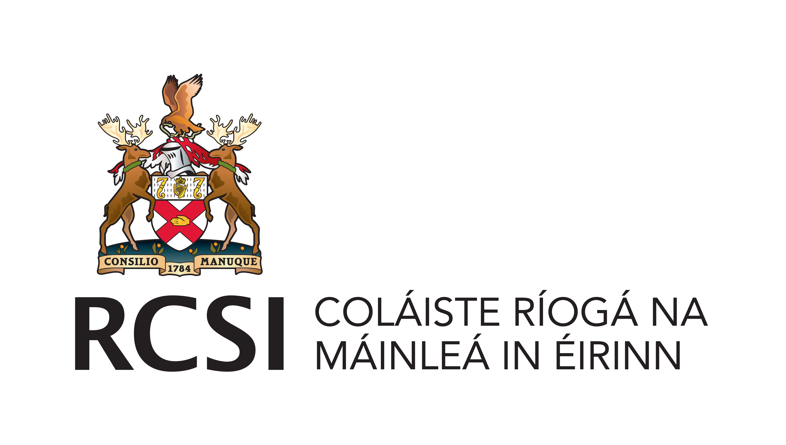

# DIAMOND: Developing Innovative Analytical Methods for research ON Deprescribing

**Code for generating simulated data and performing statistical analysis on deprescribing**

Overview
--------
### The aims of this program are to: 

(i) develop and advance novel methods to research deprescribing by harnessing big data, 

(ii) apply these methods to generate knowledge and discoveries that improve our understanding of the benefits and harms of deprescribing. 
