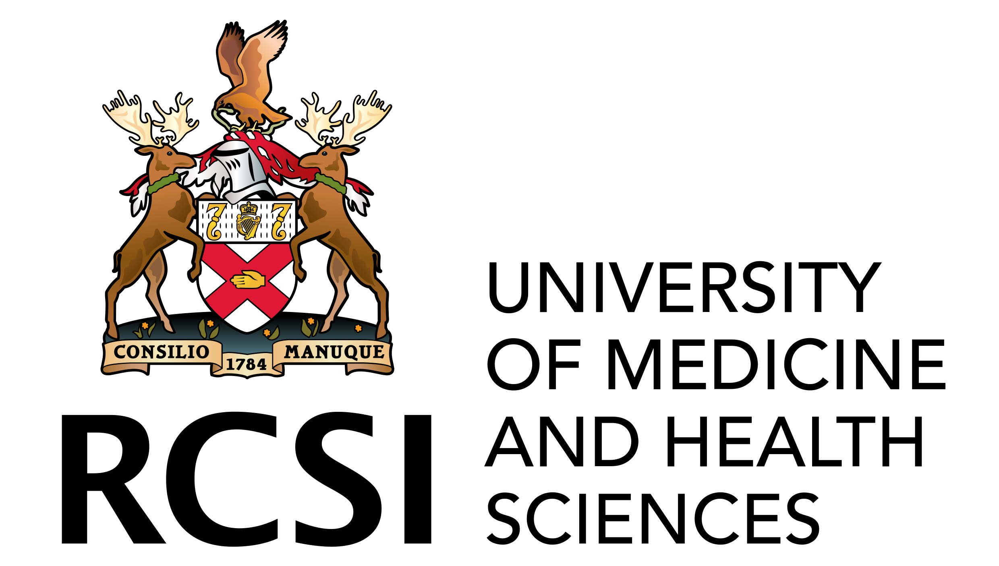

  
  

**Code for generating simulated data and performing statistical analysis on data related to deprescribing**

Website: https://diamond-deprescribing.eu/

## Overview

### The aims of this program are to: 

(i) develop and advance novel methods to research deprescribing by harnessing big data, 

(ii) apply these methods to generate knowledge and discoveries that improve our understanding of the benefits and harms of deprescribing.

## Navigating this repository
Each sub-workpackage has a dedicated folder in main named *sub_WP_number_sub_WP_name*. The folder structure for each sub-workpackage is shown below.

## Workpackages
- 2.1 [Simulation study of target trial emulation in deprescribing](2.1.a.emulat_sim1)
- 2.1_a [Simulation study practices in pharmacoepidemiology - a methodological review](2.1.a_i.emulat_sim_brief)
